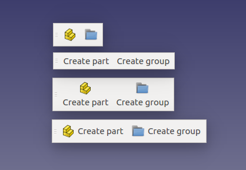

# ToolbarStyle
Customizable FreeCAD toolbar style.

### Installation
Install path for FreeCAD modules depends on the operating system used.

##### Examples:
Linux:

`/home/user/.FreeCAD/Mod/ToolbarStyle/InitGui.py`

macOS:

`/Users/user_name/Library/Preferences/FreeCAD/Mod/ToolbarStyle/InitGui.py`

Windows:

`C:\Users\user_name\AppData\Roaming\FreeCAD\Mod\ToolbarStyle\InitGui.py`

### Usage
Open toolbar style preferences (Tools -> Accessories -> Toolbar style) and set preferred style.

### Feedback
Feedback can be posted to this [FreeCAD forum thread](https://forum.freecadweb.org/viewtopic.php?f=34&t=26695)

